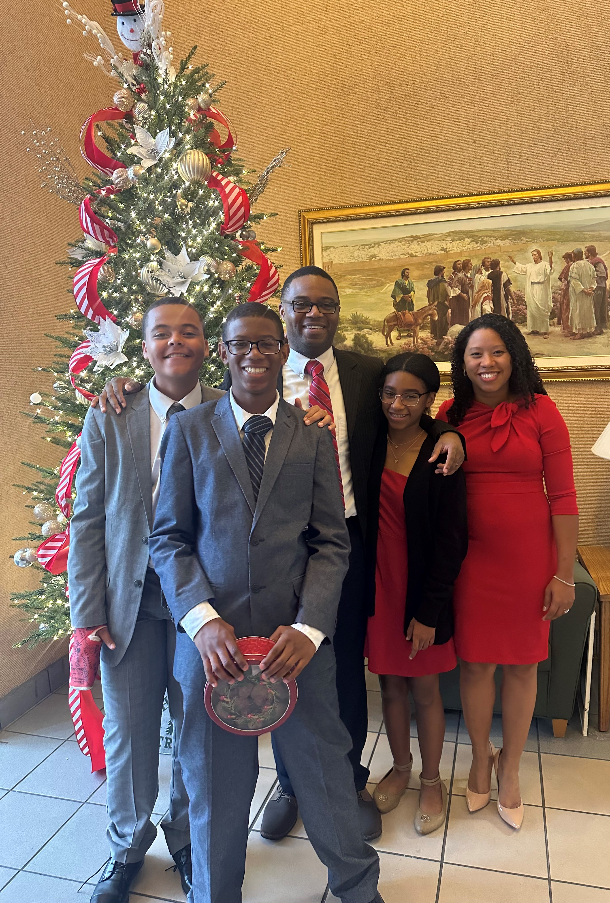

# Hi there 👋
# Welcome Im Dulce !!

## My family

### I am a wife, mother, and student

>I have been married for 15 years, I have 3 teenagers one girl and two boys.

>I will be graduating with my Bachelors in Software development in May 2023

- 🔭 I’m currently working on my Bachelor's Degree at Broward College
- 🌱 I’m currently learning Software Development
- 👯 I’m looking to collaborate on more projects
- 🤔 I’m looking for help with learning how to write code
- 💬 Ask me about anything!!
- 📫 How to reach me: wild15@mail.broward.edu
- 😄 I love all things sweet! My two favorite desserts are key lime pie and ice cream 
- ⚡ Fun fact: I love to sleep, shop, watch movies and go to the beach.

### Programming Languages I have learned so far

 

<!--START_SECTION:activity-->

<!--
**wilsd15/wilsd15** is a ✨ _special_ ✨ repository because its `README.md` (this file) appears on your GitHub profile.

Here are some ideas to get you started:

-->
